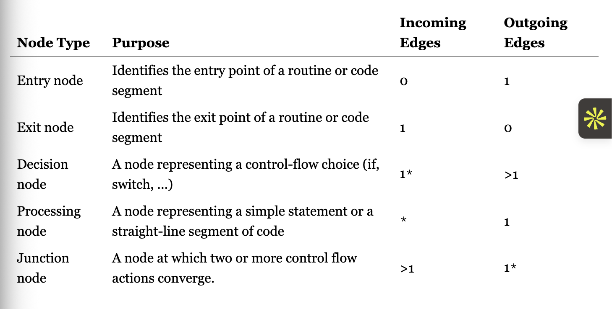

# White Box Testing!

## Code Based Test Coverage

- Tests the thoroughness of logical elements testing in the source software by the test suite. 
- If a logical element is not used during testing then there could very easily be issues in the system after testing.
- White box because we are actually examining the source code and how the data actually flows.

## Control Flow Graphs

- Diagram of the code and how it flows with nodes representing code segments and edges representing control flow like if statements.
- Directed graph with the following node types:

Pure decision nodes have once incoming edge while pure junction nodes always have one outgoing edge.

### Control Flow Graph Primitives

- For each type of structured statement or control feature in a language, a primitive control flow graph can be defined to show the canonical structure.
- TLDR even in or and statements we have to create a break point for each thing. For testing. That is called short circuiting when we do not execute the next section of code because we know one part forces it to be one or the other.

## Basic Structural Coverage: Statements and Branches

Statement coverage also known as node coverage is based on the proportion of the processing nodes that are exercised during testing.

Branch Coverage also know as edge coverage is based on the edges that are taken during testing, always counting else and default branches even if they are not explicitly present.

### What is better?

- Because 100% branch coverage implies 100% statement coverage it is generally considered better.

### Condition Based Coverage

- With control flow predicates like | it is generally possible to get full branch coverage but not test all conditions. 
- All condition coverage tests literally every possible condition and is generally considered to be better than branch which also makes it better than statement.

## Path Based Coverage

- Sequences of nodes encountered during program execution. It tests combinations of statements or branches.
- This tests all combinations by requiring all entry exit paths through that flow graph are exercised.
- But the only problem is that in loops paths could become infinite. So it is impossible to apply this criterion.
- Exponential Number of Paths.

Other path based criteria exist such as the following with the most promising focus on cycle free definition use paths.

A definition point is a point at which a variable is assigned a value.
A use point is a point at which the variable value is accessed.
A definition-use path is a control flow path between a definition and a use of a given variable, with no intervening redefinition of the variable.
The cycle-free all definition-use paths criteria ensures that every such definition-use path is covered.

So we can also do something called edge pair coverage where each path of length <=2 is tested

Given a number k, test k paths.

For Dealing with loops we have Simple Paths, No node appears more than once in the path, can capture the acyclic behaviors of a program. (Basically go through the loop once)

Prime Paths A simple path that is not a subpath of ant other simple path. (Longest Simple Path possible If Path x is contained entirely within path y is not prime.)

Prime Path Coverage covering all prime paths

## Black Box Testing

- Only Concerned with input or requirements of a software under test. Opaque box is the code.

## Goal is full coverage but is that reasonable?

- We must consider the Syntactic Reachability like if there is a return and then some code that is 100% impossible to reach. Theoretically Reachable. 
- Semantic Reachability based on the meaning of the code. So can it execute literally given the regular constraints of the code. Vs Realistically reachable.
- So there have to be relative degrees of coverage

## Summary

- Graph coverage is common basis for measuring test suite adequacy with branch coverage is the most common cost-effective approach
- Path Coverage Criteria can provide deeper insight into subtle logic interactions, subtle loop behaviours, but managing cost can require care.
- Graphs are everywhere.